# DEAW

En este documento se detallan los pasos necesarios para realizar ejercicios básicos de Git y Github

## Respositorios de GitHub

Un repositorio de GitHub es un espacio donde puedes almacenar, organizar y gestionar proyectos. Básicamente es como un contenedor para archivos de código, documentación y recursos relacionados con un proyecto. Es esencial para gestionar y colaborar en proyectos de software de forma eficiente.

### Creación de un repositorio

1. Acceder a tu [cuenta de GitHub](https://github.com/login).
2. Crear un nuevo repositorio, en este caso **DEAW**.
   1. Para ello simplemente tenemos que darle al icono de nuestro perfil en la esquina superior derecha de la pantalla.
   2. Hacer click en donde pone `Your repositories`
   3. Clicar en `New`
   4. Rellenar los campos necesarios
      1. **`Owner*`** - Nuestro usuario de GitHub
      2. **`Repository name*`** - DEAW
3. Asegurarse (en este caso) de que sea público y no tenga archivos por defecto.
4. Clicamos donde dice `Create repository` en la esquina inferior derecha.

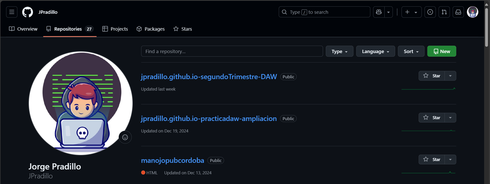
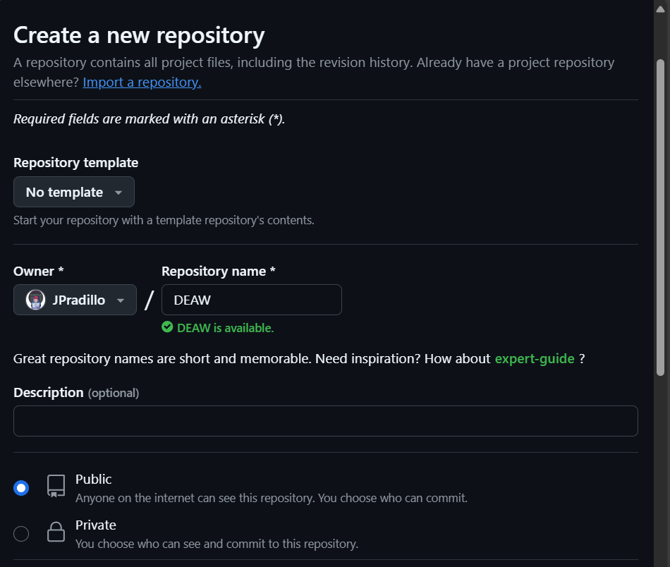

### Clonar el repositorio

Una vez creado el repositorio, lo que haremos será clonarlo y de esta manera poder tenerlo en local y así realizar los cambios que sean necesarios. Para ello seguirimos los siguientes pasos:

##### Opción 1
En el caso de no haber añadido ningún archivo nos mostrará la siguiente ventana:
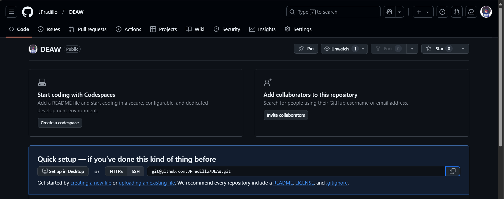

En este caso simplemente tendremos que ir siguiendo los pasos que se indican en el repositorio, los cuales son:

1. `git init` - Crear un repositorio en nuestra máquina local. Este repositorio se creará en la carpeta en la que nos encontremos al realizar este comando.
2. `git remote add URL_DEL_REPOSITORIO` - Conectamos nuestro repositorio local al repositorio remoto de GitHub. 

##### Opción 2
En el caso de que hayamos añadido algún archivo README: 
1. Clicar en la parte de nuestro repositorio que pone **`Code`**.
2. En el apartado **`HTTPS`** lo que haremos será copiar el enlace de nuestro repositorio. Por ejemplo en mi caso es [así](https://github.com/JPradillo/DEAW.git).
3. Ahora en nuestra **terminal Bash** escribimos el comando `git clone [ENLACE QUE HEMOS COPIADO]`
4. Una vez clonado el repositorio lo que tenemos que hacer es cambiar al directorio que se ha creado con el `.git`, para ello tenemos que ejecutar el comando `cd [NOMBRE_DEL_RESPOSITORIO]`.

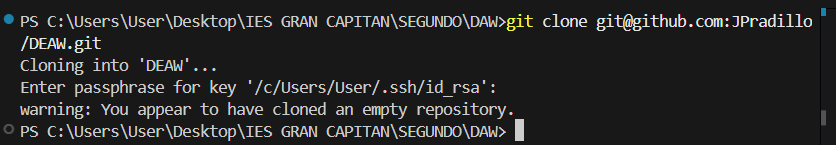
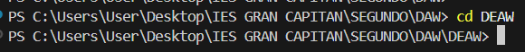

## Añadir archivos 

Para poder hacer que los archivos que creemos en este directorio se suban al repositorio simplemente tenemos que ejecutar 3 comandos muy simples.

1. `git add [NOMBRE_ARCHIVO]` - Añade todos los archivos modificados al repositorio local.
2. `git commit -m "Comentario"` - Hacer un commit para poder subir los archivos asignandoles un `id`. **ESTE PASO ES OBLIGATORIO**.
3. `git push origin [RAMA]` - Sube los cambios a la rama que queramos asignarle (siempre que exista anteriormente) del repositorio remoto.

> ℹ️Info
>
> Estos pasos se pueden resumir en dos comandos solamente, los cuales son:
> 
> `git commit -a -m "Comentario"`
> 
> `git push origin [RAMA]` 
> 
> Esto lo que hace es añadir todos los archivos al mismo commit y los sube al repositorio remoto. Esto también se puede hacer con el comando `git add .`

En este apartado lo que hicimos fue primero crear un archivo README con un pequeño texto y posteriormente lo añadí al repositorio con un commit que decía `Comenzamos con los ejercicios de Git`

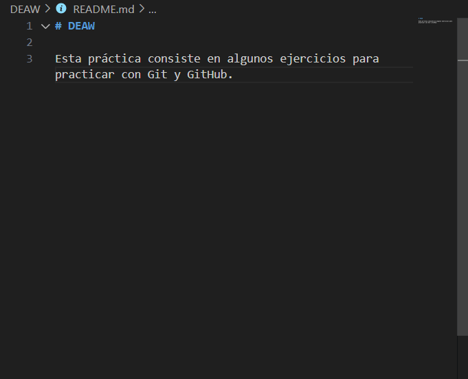
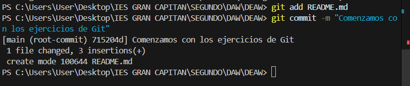

## Ignorar archivos

En GitHub todos los que se indiquen en un archivo llamado `.gitignore` provoca que estos no sean subidos al repositorio remoto. En mi caso son un archivo y un documento llamados `privado.txt` y `privada`. Para ello seguimos los siguientes pasos:

1. `touch privado.txt` - Creamos un archivo `privado.txt`. 
2. `mkdir privada` - Creamos la carpeta `privada`.
3. `nano .gitignore` - Abrimos el archivo `.gitignore` con nano para editar su contenido.
4. Añadimos los nombres de los elementos que no queremos subir al repositorio.

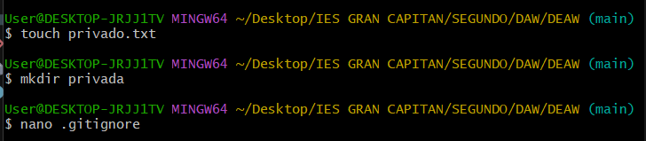
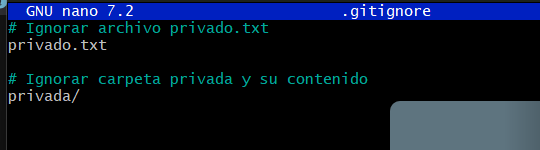

Una vez hecho esto, cada vez que yo haga un push al repositorio remoto, estos dos documentos quedarán excluidos del commit por lo que no se subirán a dicho repositorio.

Para comprobar que realmente no se han subido, una vez hecho el commit ejecutamos el comando `git status`. Esto lo que hará será mostrarnos las diferencias entre el repositorio local y el remoto y de esta manera poder ver los archivos que vamos a subir a GitHub o aquellos que han sido modificados.

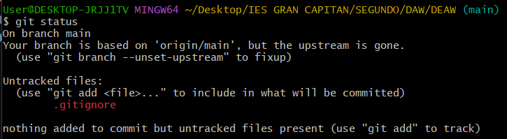

## Tags

En este apartado primero crearemos el archivo `1.txt` y de esta manera tener controlados los tags que añadamos.

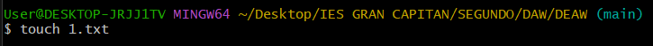

### Creación de tags

Para crear un tag es muy sencillo, simplemente tenemos que ejecutar el comando `git tag [NOMBRE_DEL_TAG]`. En mi caso, mi tag se llama `v0.1` ya que es la primera versión, asi que tuve que ejecutar el comando `git tag v0.1`.

### Ver tags creados

Para poder visualizar todos nuestros tags tenemos que ejecutar el comando `git tag` lo que nos mostrará una lista con el nombre de todos nuestros tags creados.

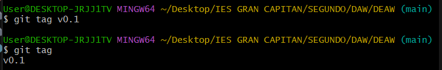

### Subir un tag

A la hora de subir un tag lo que tenemos que hacer primero es pushear este tag al repositorio remoto ejecutando el comando `git push origin v0.1` en mi caso.

### Subir todos los tags

Si quieres subir varios tags a la vez, lo que tienes que hacer es ejecutar el comando `git push --tags` lo que hará que se suban todos los tags que tengas en ese momento en el repositorio local.

### Borrar un tag

Para borrar un tag tienes que ejecutar el comando `git tag -d v0.1` por ejemplo en mi caso si quieres borrarlo localmente. 

En el caso de que quieras hacerlo con un tag que ya fue subido al repositorio remoto tendrías que ejecutar el comando `git push origin --delete v0.1`

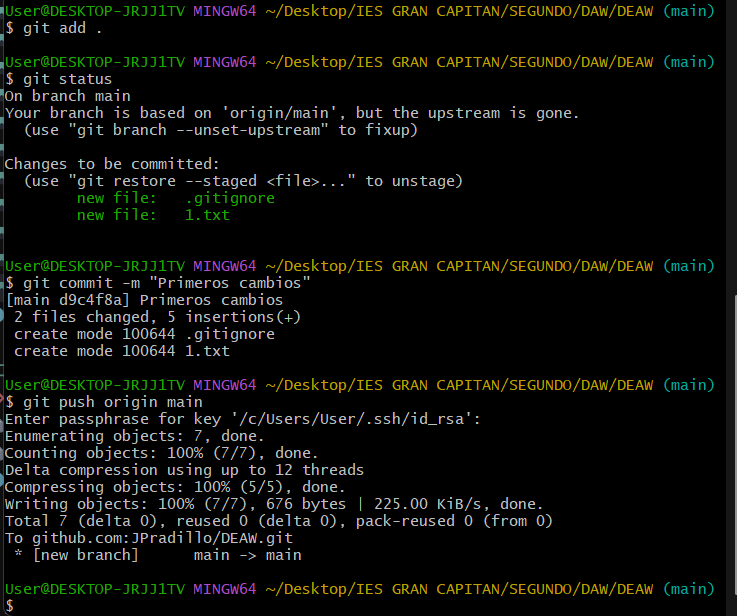

## Cuenta de GitHub

Es importante en el mundo del desarrollo tener actualizados nuestros perfiles, y GitHub no va a ser distinto. Por lo tanto en esta práctica se mostrará cómo hacer para tener tu cuenta actualizada.

### Foto de perfil
Para poner una foto en nuestro perfil de GitHub tenemos que seguir los siguientes pasos:

1. Acceder a [nuestra cuenta de GitHub](https://github.com/login)
2. Acceder a la configuración del perfil
   1. Hacemos clic en nuestro avatar (esquina superior derecha)
   2. Seleccionamos la opción de `Settings`
3. En el menú lateral izquierda hacemos click en el apartado que dice `Public profile`
4. Junto a nuestro avatar actual hacemos click en donde pone `Upload new picture`
5. Seleccionamos la imagen que queramos poner de perfil (Algo que nos represente)
6. Guardamos los cambios

En mi caso, ya lo tenía cambiado de antes, pero mostraré los pasos a seguir.

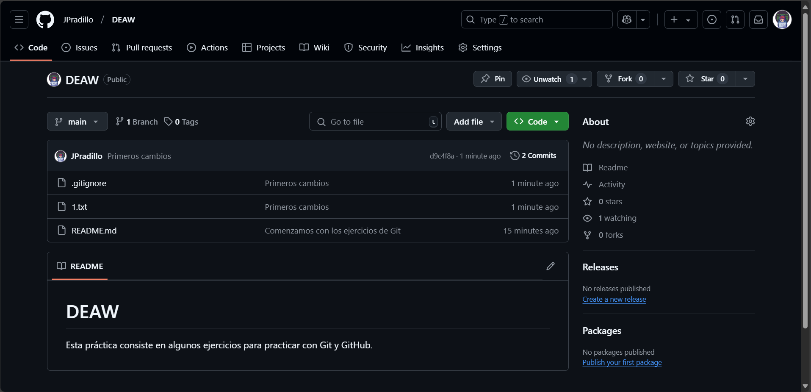
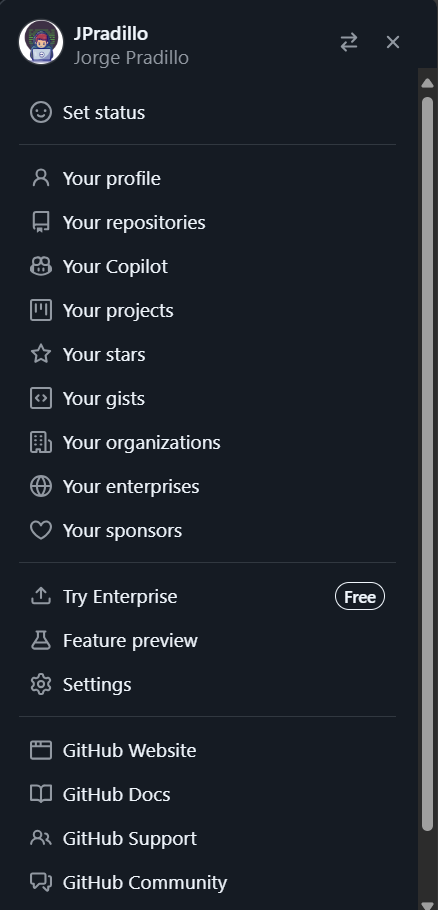
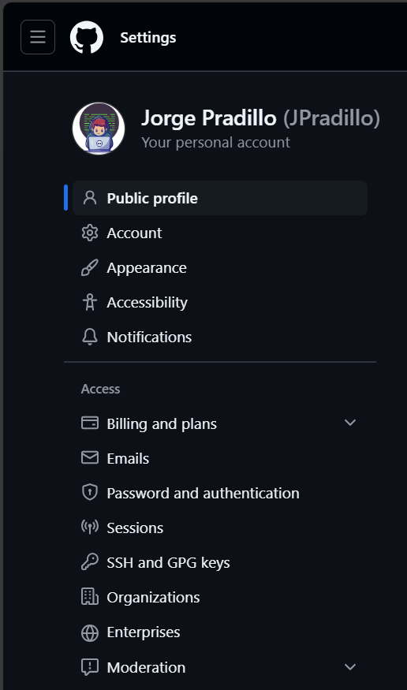
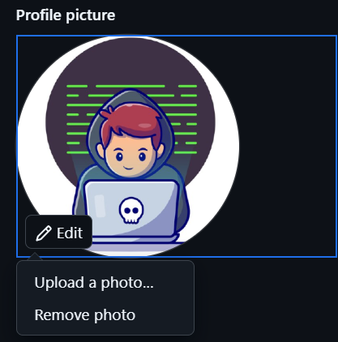

### Autenticación en dos pasos

Al configurar la autenticación en dos pasos conseguimos tener más protegida nuestra cuenta. Este proceso agrega una capa adicional de seguridad a nuestra cuenta al requerir un paso adicional para iniciar sesión además de tu contraseña. GitHub ofrece varias opciones para configurar la autenticación en dos pasos.

1. Aplicaciónes de autenticación
   1. Google Authenticator
   2. Authy
   3. Microsoft Authenticator
   4. 1Password
2. Llaves de seguridad
3. Mensajes de texto por SMS
4. GitHub Mobile

Para ello simplemente tenemos que seguir los siguientes pasos:

1. Acceder a [nuestra cuenta de GitHub](https://github.com/login)
2. Ir a la configuración de seguridad
   1. Hacemos clic en nuestro avatar
   2. Seleccionamos la opción `Settings`
   3. En la barra lateral izquierda vamos a la sección `Passwords and authentication`
3. Configurar **2FA**
   1. En la sección `Two-factor authentication` y hacemos clic en `Enable two-factor authentication`
   2. Hacemos clic en `Set up using an app` para configurar 2FA con una aplicación de autenticación.
4. Escaneamos el código QR con nuestra aplicación de autenticación en nuestro dispositivo móvil.
5. Introducimos el código de verificación que ha generado dicha aplicación
6. Generamos códigos de recuperación y los guardamos en un lugar seguro para usarlos en el caso de que perdamos el acceso a la aplicación de autenticación
7. Verificamos la activación la próxima vez que iniciemos sesión

En mi caso, como ya lo tenía configurado voy a mostrar simplemente las capturas que muestran dicha comprobación.


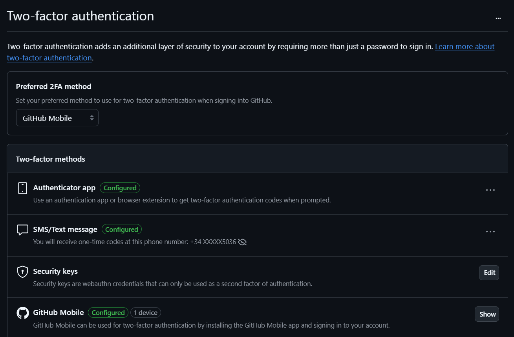

## Usuarios de GitHub

A la hora de querer seguir a distintos usuarios de GitHub tenemos que poner en el navegador la siguiente url:

```url
https://github.com/nombre_usuario
```

donde `nombre_usuario` es el nombre de la persona que queremos seguir en GitHub. En la siguiente tabla muestro los usuarios de distintos compañeros de clase, os animo a que los sigáis y de esta forma podáis ver sus repositorios públicos y todos los proyectos que suban a la plataforma. 

| NOMBRE                  | GITHUB                                            | IMAGEN                                  |
|-------------------------|---------------------------------------------------|-----------------------------------------|
| Alejandro Ruiz          | [Perfil GitHub](https://github.com/a22rucral)     | 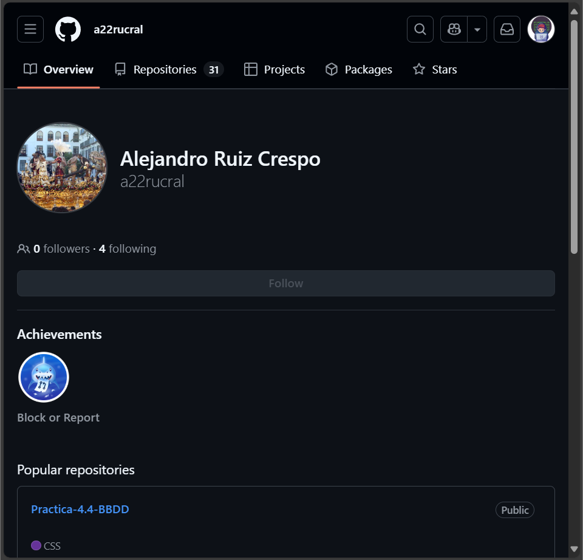 |
| Manuel Ortiz            | [Perfil GitHub](https://github.com/manuelortiz12) | 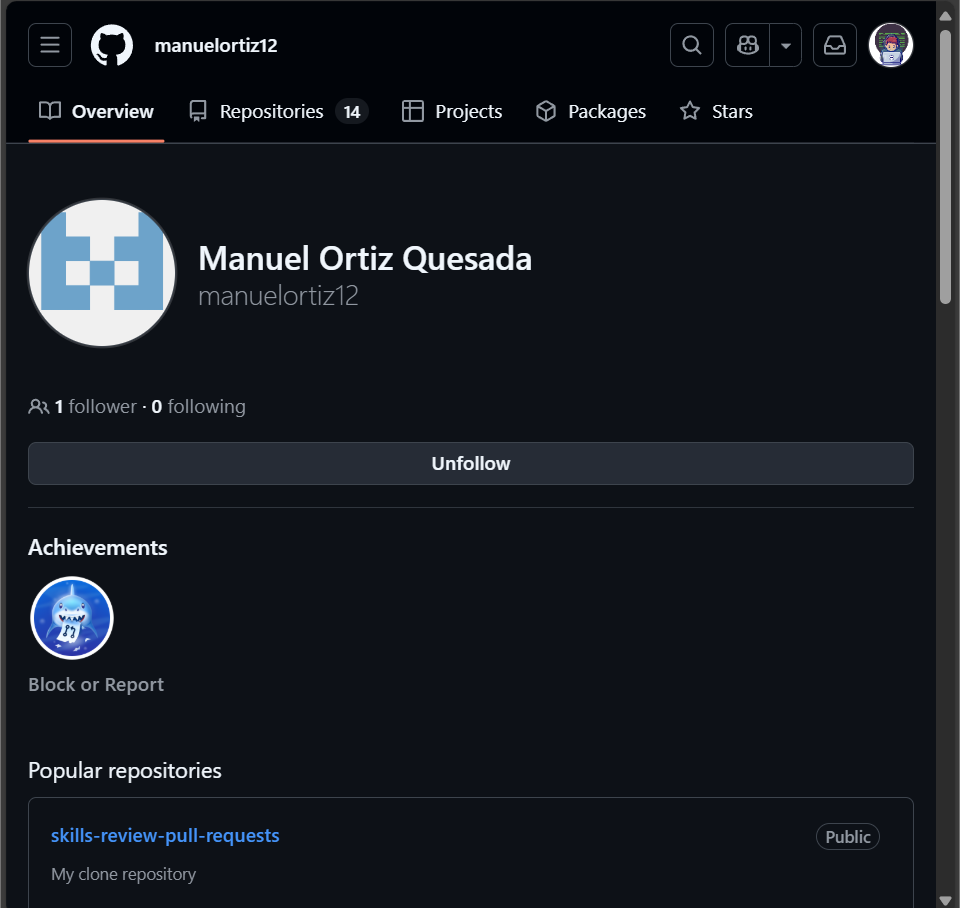    |
| Salvador Martínez       | [Perfil GitHub](https://github.com/valfrio)       | 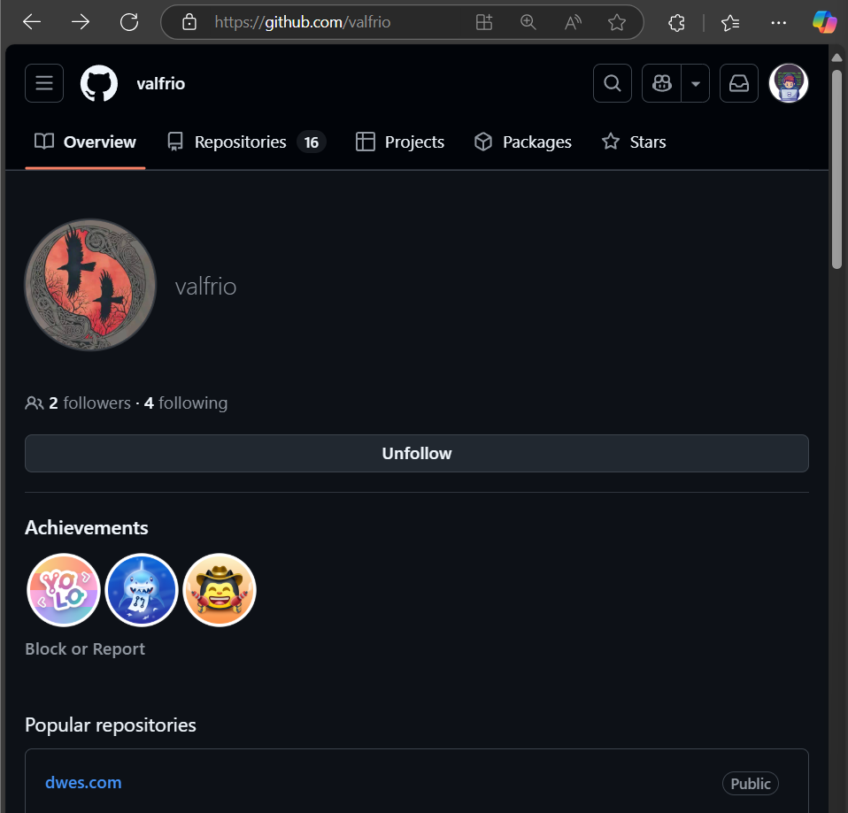  |

### Seguir otros repositorios

Para seguir otros repositorios de usuarios simplemente hay que identificar los repositorios yendo al perfil del usuario y una vez localizado y encontrándonos en él, hacemos clic sobre `Watch` en la parte superior izquierda (en el caso que esté minimizado el navegador, sino derecha) de la página del repositorio.

En mi caso, el repositorio elegido fue el mismo de esta práctica, `github.com/nombre_usuario/DEAW`. En el caso de la imagen que se muestra es el repositorio de Alejandro Ruiz.

Cuando se despliegue el menú podemos elegir cualquiera de las opciones pero en mi caso elegi la opción de toda la actividad que tenga ese repositorio.

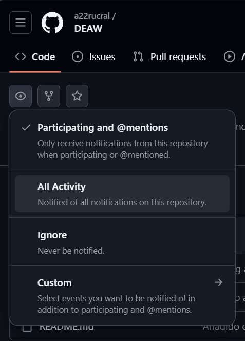

### Añadir a favoritos otro repositorio

Seguimos los mismos pasos que el caso anterior hasta encontrarnos en dicho repositorio. En el veremos un botón con el icono de una estrella ⭐ junto a `Watch`. Simplemente tenemos que hacer clic sobre este botón y una vez que cambia de color y se pone de color amarillo ya estaría hecho.

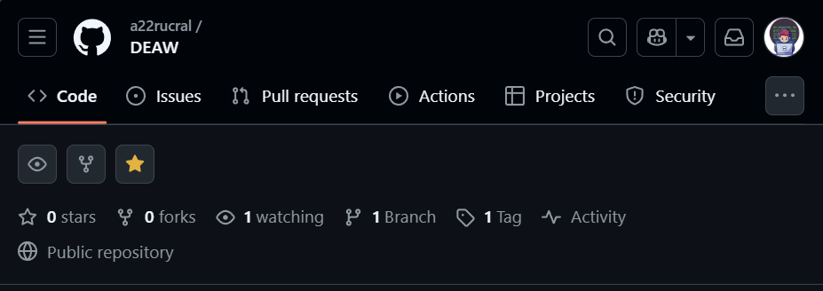

### Añadir colaborador

Para añadir un colaborador a nuestro proyecto simplemente tenemos que ir al repositorio donde se encuentra dicho repositorio y tenemos que ir al apartado `Settings` que se encuentra en el menú del repositorio.

Nos movemos hasta el apartado de `Collaborators and teams` y una vez ahí clicamos en el botón `Add people`. Aquí se abrirá una ventana y tendremos que poner el nombre de usuario que queramos añadir como colaborador y seleccionar el permiso que queramos. En mi caso añadí a mi compañero Manuel Ortiz. 

Una vez enviada la solicitud simplemente tenemos que esperar que acepte la invitación y ya pasaría a ser colaborador de mi respositorio [github.com/JPradillo/DEAW](https://github.com/JPradillo/DEAW). 


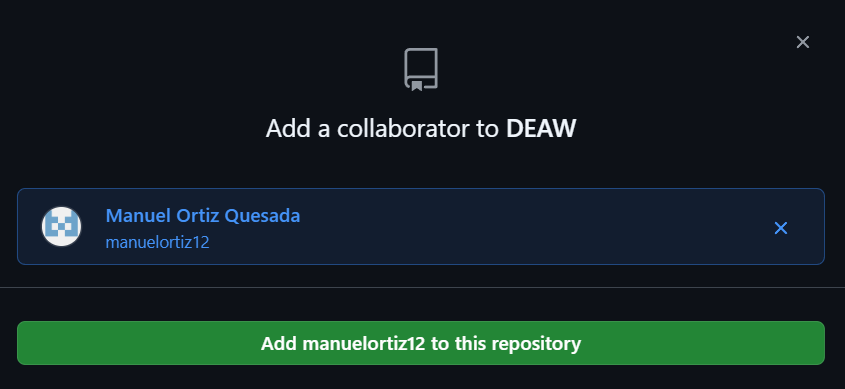

## Merge

### Merge de ramas

Ahora con el comando `git branch v0.2` procedemos a crear una nueva rama y con `git checkout v0.2` nos cambiamos a ella.

Esto se puede hacer con un solo comando que es `git checkout -b v0.2`.

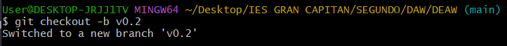

Posteriormente y ya ubicados en esta rama creamos un archivo llamado 2.txt y subimos los cambios al repositorio remoto para asi poder visualizar los cambios finales.

Para ello simplemente ejecutamos los siguientes comandos:

```bash
echo "Contenido del archivo 2.txt > 2.txt"

git status

git add 2.txt

git commit -m "Añadido 2.txt en la rama v0.2"

git push origin v0.2
```

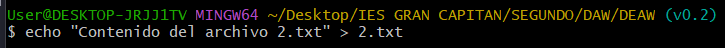
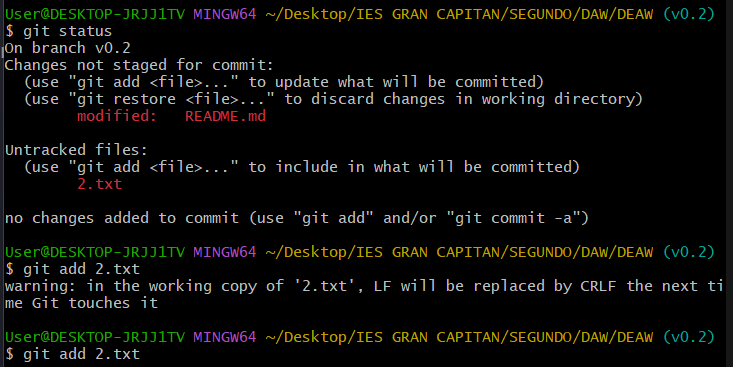
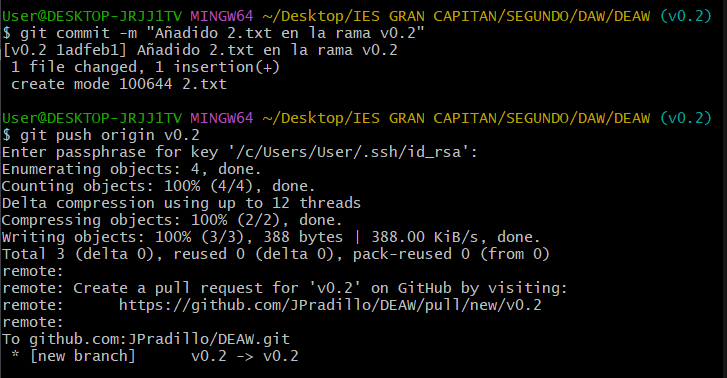
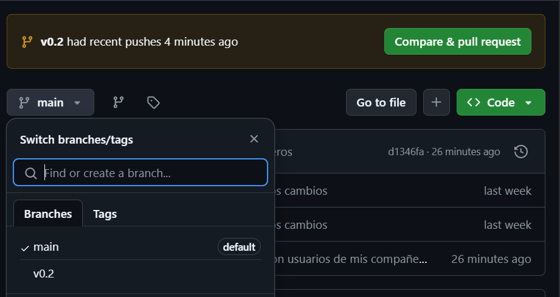

Después de haber hecho todo esto procedemos a hacer un merge. Esto quiere decir que los cambios realizados en la rama v0.2 los uniremos a la rama main y de este modo aplicar en la ultima rama los cambios hechos en el repositorio local. Para ello, lo que hay que hacer es cambiar de rama con el comando `git checkout main` y posteriormente haremos un merge con el comando `git merge v0.2`. Posteriormente añadiremos los cambios al main del repositorio remoto con el comando `git push origin main`

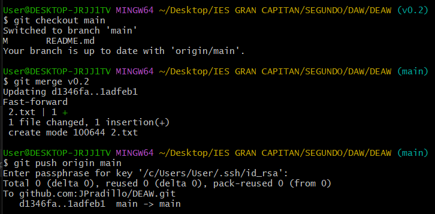
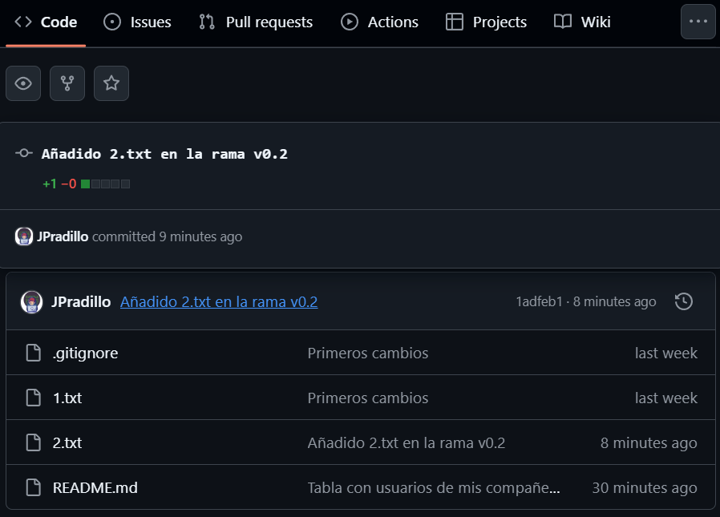

### Merge con conflicto

Puede pasar que a la hora de hacer un merge veamos que hay un archivo con distinta configuración en cada una de las ramas. Esto lo que provocará es un conflicto y para arreglarlo tendremos que hacer lo siguiente:

1. Identificar los archivos en conflicto. Para ello ejecuta el comando `git status`
2. Abre el archivo con conflictos, lo que mostrará algo como: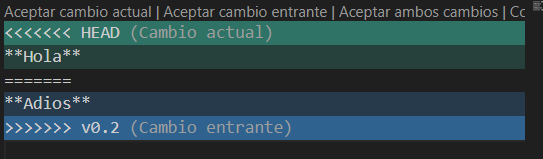
3. Edita y resuelve eliminando las marcas (`<<<<<<<`, `=======`, `>>>>>>>`) y decide que contenido conservar.
4. Sube los cambios

En mi caso cree un archivo escribí **Hola** en el archivo 1.txt e hice un commig. Posteriormente me fui a la rama `v0.2` y cambié el **Hola** por **Adios** e hice otro commit. Esto lo que provocó es que al intentar hacer un merge con la rama v0.2 desde main me generó un conflicto.

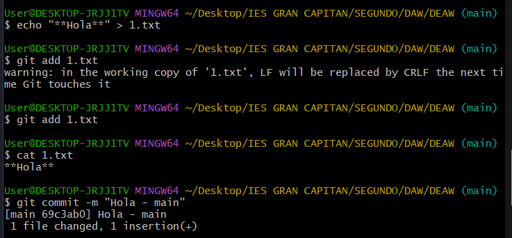
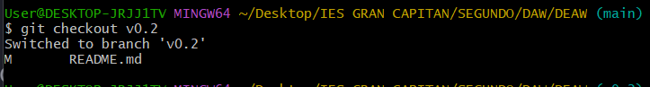
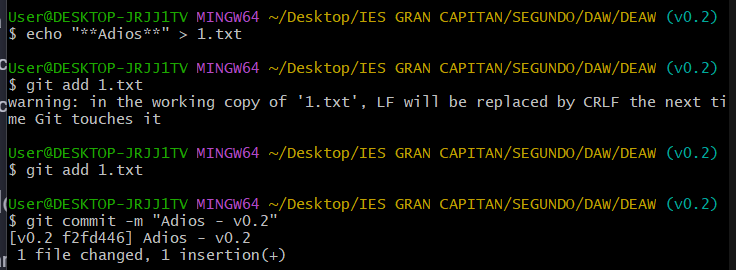
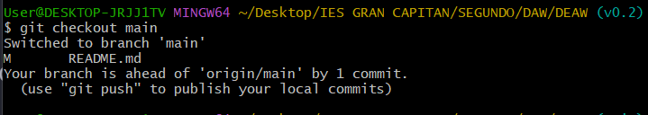
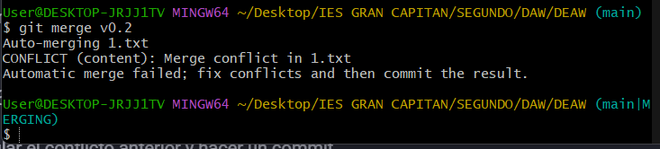

## Listado de ramas

Para listar las ramas con y sin merge y de esta forma saber si se han subido los cambios hechos simplemente hay que ejecutar en la terminal los siguientes comandos:

* `git branch --no-merged` - Para listar las ramas sin merge
* `git branch --merged` - Para listar las ramas con merge

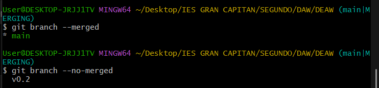

## Arreglo de conflictos

Como hemos dicho anteriormente, arreglar un conflicto es simple si se trata de texto plano, sin código de programación, pero esto se vuelve más complejo si hablamos de código de programación por lo que es importante tener los dos repositorios actualizados constantemente y de esta forma se puede evitar más fácil, pero nada te asegura que no te vaya a causar problemas en el futuro.


En mi caso lo que hice fue dejar los dos saludos y de esta forma arreglarlo de forma sencilla.

## Borrar ramas

En este paso lo que haremos será crear un tag v0.2 con el comando `git tag v0.2` y borraremos la rama con el mismo nombre. Para ello ejecutaremos `git branch -d v0.2`. Si la rama aún no ha sido fusionada y deseas forzar su eliminación, puedes usar `-D` en vez de `-d`. 

Luego, para que no haya conflictos eliminaremos la rama v0.2 del repositorio remoto, para ello ejecutaremos el comando `git push origin --delete v0.2` y posteriormente subiremos el tag al repositorio con el comando `git push origin v0.2`.

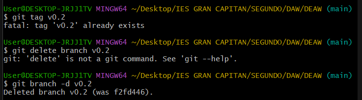
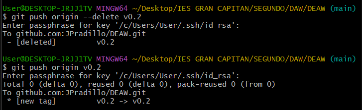

## Listado de cambios

Para poder ver todos los cambios realizados en el repositorio con sus ramas y sus tags tenemos que ejecutar el comando `git log --oneline --all --decorate --graph`. Esto mostrará un mapa lineal de todos los commits que hemos realizado en el repositorio.

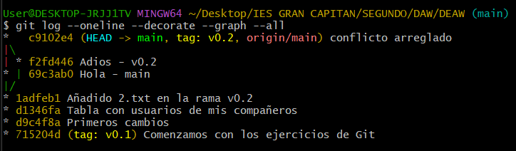

En la siguiente imagen lo que se muestra es el resultado final que se muestra en el [repositorio remoto](https://github.com/JPradillo/DEAW) para cualquier pesona que acceda la repositorio. 

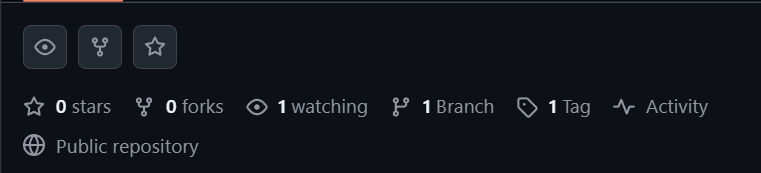