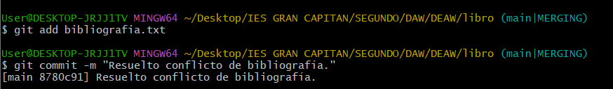

# GitHub Parte 2

Este documento proporciona una descripción detallada de la práctica de manejo de repositorios utilizando Git, desde la configuración inicial hasta la colaboración en un repositorio remoto en GitHub. Aquí se explica cómo realizar diversas tareas de gestión de código fuente, como la creación de repositorios, manejo de cambios, control de versiones, trabajo con ramas y colaboración en línea.

## Objetivos

**Configurar Git**: Establecer configuraciones de usuario, correo electrónico y colorización de la salida en consola.

**Gestionar un repositorio local**: Crear repositorios, agregar archivos, realizar commits y visualizar el estado del repositorio.

**Controlar el historial de cambios**: Ver el historial de commits, comparar cambios entre versiones y trabajar con diferencias.

**Deshacer cambios**: Aprender a revertir cambios en archivos, restaurar versiones anteriores y eliminar commits.

**Manejo de ramas**: Crear, fusionar y eliminar ramas, así como gestionar conflictos de fusión.

**Repositorios remotos**: Configurar repositorios en GitHub, realizar pushes y pulls, y colaborar en proyectos remotos.

### Configuración Inicial de Git

#### Configuración del usuario
Define tu nombre y correo electrónico para asociarlos con tus commits:

```bash
git config --global user.name "JPradillo"
git config --global user.email "a23prhijo@iesgrancapitan.org"
```

#### Habilitar Coloreado de Salida

Activa la coloración de la salida en los comandos:

```bash
git config --global color.ui auto
```


Verificamos que la configuración haya sido correctamente aplicada:

```bash
git config --list
```


### Creación y Gestión de Repositorios Locales

Inicializamos un repositorio vacío:

```bash
mkdir libro

cd libro

git init
```


### Crear y Añadir Archivos

Creamos un archivo indice.txt y agrégalo al repositorio:

```bash
echo "Capítulo 1: Introducción a Git" > indice.txt

git status

git add indice.txt

git status

git commit -m "Añadido índice del libro"
```


### Comprobar el Estado del Repositorio

Verificamos el estado del repositorio con:

```bash
git status
```


### Realizar Cambios y Commits

#### Modificar un Archivo y Realizar un Commit

Editamos el archivo indice.txt y guardamos los cambios:

```bash
echo "Capítulo 2: Flujo de trabajo básico" >> indice.txt

git diff

git add indice.txt

git commit -m "Añadido capítulo 2 sobre flujo de trabajo básico"

git status

git log --oneline
```


### Cambiar el Mensaje del Último Commit

Si necesitas modificar el mensaje de tu último commit ejecutamos el siguiente comando:

```bash
git commit --amend -m "Nuevo mensaje para el commit"

git log --oneline
```


### Manejo del Historial de Cambios

#### Visualizar el Historial de Commits

Revisamos el historial de commits realizados:

```bash
git log --oneline
```


##### Capítulo 1

Creamos la carpeta capitulos y dentro de esta creamos el fichero capitulo1.txt con el siguiente texto y añadimos los cambios a la zona de intercambio temporal con el mensaje ***Añadido capítulo 1***

```Git es un sistema de control de versiones ideado por Linus Torvalds```


##### Capítulo 2

Creamos el archvio capitulo2.txt en la carpeta capitulos con el siguiente texto y añadimos los cambios a la zona de intercambio temporal con el mensaje ***Añadido capítulo 2***

```El flujo de trabajo básico con Git consiste en: 1- Hacer cambios en el repositorio. 2- Añadir los cambios a la zona de intercambio temporal. 3- Hacer un commit de los cambios.```


### Ver Diferencias Entre Versiones
Muestra las diferencias entre la última versión y una versión anterior:

```bash
git diff HEAD~1
```


##### Capítulo 3

Creamos el archvio capitulo3.txt en la carpeta capitulos con el siguiente texto y añadimos los cambios a la zona de intercambio temporal con el mensaje ***Añadido capítulo 3***

```Git permite la creación de ramas lo que permite tener distintas versiones del mismo proyecto y trabajar de manera simultanea en ellas.```


Para ver los cambios realizados entre dos commits ejecutamos los siguientes comandos 

```bash
git log --oneline --graph --all

git diff f17dfc8 HEAD
```


Añadimos cambios en el fichero indice.txt añadiendo la siguiente línea al fichero

```Capítulo 5: Conceptos avanzados```

Para ello ejecutamos los siguientes comandos:

```bash
echo "Capítulo 5: Conceptos avanzados" >> indice.txt

git add indice.txt

git commit -m "Añadido capítulo 5 al índice"
```


### Ver Quién ha hecho los Cambios

Para poder ver la persona que ha realizado los cambios en un archivo tenemos que ejecutar el comando 

```bash
git log --follow -- indice.txt
```


### Deshacer Cambios

Primero procedemos a borrar una línea del fichero indice.txt. Para ello podemos utilizar un editor de texto o como ha sido en mi caso, usar comandos como `sed` para eliminar la última línea del archivo 

```bash
sed -o '5d' indice.txt
```


Comprobamos el estado del repositorio y deshacemos los cambios con los siguientes comandos:

```bash
git status

git checkout -- indice.txt
```


Ahora volvemos a hacer los primeros pasos (borrar la ultima línea) y añadimos los cambios a la zona de intercambio temporal. Para ello ejecutamos los siguientes comandos:

```bash
sed -o '5d' indice.txt

git add indice.txt

git status
```


Quitamos los cambios de la zona de intercambio temporal pero los mantenemos en el directorio de trabajo. Esto se consigue con el siguiente comando:

```bash
git reset HEAD indice.txt

git status
```


Ahora vamos a proceder a deshacer los cambios realizados en el fichero indice.txt para volver a la versión anterior del fichero. Para ello ejecutaremos

```bash
git checkout -- indice.txt

git status
```


Ahora volveremos a eliminar la última línea del fichero indice.txt y lo guardaremos con el comando:

```bash
sed -i '5d' indice.txt
```


Borramos el fichero capitulos/capitulo3.txt y añadimos un nuevo archivo en el directorio capitulos llamado capitulo4.txt vacío al intercambio temporal. Posteriormente nos fijamos en el nuevo estado del repositorio. Para ello ejecutamos los siguientes comandos

```bash
rm capitulos/capitulo3.txt

ls -la capitulos/

touch capitulos/capitulo4.txt

git add indice.txt capitulos/capitulo4.txt capitulos/capitulo3.txt

git status
```


#### Deshacer cambios para volver a la versión del repositorio

Para poder volver a la versión del repositorio simplemente tenemos que ejecutar el comando y luego procedemos a consultar el estado del repositorio

```bash
git reset HEAD

git status
```


Ahora vamos a hacer lo mismo pero deshaciendo el último commit y los cambios anteriores del directorio de trabajo volviendo a la versión anterior del repositorio y posteriormente vemos el estado en el que nos encontramos ejecutando los comandos 

```bash
git checkout -- .

git status
```


### Ramas

Para crear una rama, como se vio en la práctica anterior, simplemente hay que ejecutar el comando 

```bash
git branch NOMBRE_RAMA
```

En este caso vamos a crear la rama bibliografia y es en la que nos apoyaremos para realizar todo el contenido de ramas de esta documentación.

Para ello ejecutamos dos comandos. El primero será para crear la rama y el segundo para comprobar qué ramas tenemos en nuestro repositorio. Es importante que a la hora de crear una rama la subamos al repositorio remoto para que quede un registro de los cambios realizados sin que afecte potencialmente a la aplicación o al resto de código. Los comandos que tienes que ejecutar son:

```bash
git checkout -b bibliografia

git branch
```

Con `git checkout -b bibliografía` lo que estamos haciendo es cambiarnos de rama a la vez que la creamos.

Ahora creamos el fichero `capitulos/capitulo4.txt` y le añadimos el siguiente texto:

`En este capítulo veremos cómo usar GitHub para alojar repositorios en remoto` 

Posteriormente lo añadimos a la zona de intercambio temporall y hacemos un commit con el mensaje "Añadido capítulo 4". Luego mostramos la historia del repositorio incluyendo todas las ramas. Para hacer todo lo mencionado en este bloque, simplemente tenemos que ejecutar unas pocas líneas en nuestra terminal:

```bash
echo "En este capítulo veremos cómo usar GitHub para alojar repositorios en remoto." > capitulos/capitulo4.txt

git add capitulos/capitulo4.txt

git commit -m "Añadido capítulo 4."

git log --oneline --all --graph
```


Creamos el archivo bibliografía.txt y añadimos la siguiente referencia:

`Chacon, S. and Straub, B. Pro Git. Apress.`

Posteriormente añadimos los cambios a la zona de intercambio temporal y le asignamos un commit que diga "Añadida primera referencia bibliográfica.". Luego mostramos la historia del repositorio mostrando todas las ramas


#### Fusionar Ramas

Ahora que hemos añadido un archivo nuevo a la rama bibliografía, nos toca fusionar la rama con la rama main:

```bash
git checkout main

git merge bibliografia
```


#### Eliminar una Rama

Después de fusionar, elimina la rama que ya no necesitas:

```bash
git branch -d bibliografia

git log --oneline --all --graph
```


#### Conflictos

Ahora vamos a forzar un conflicto entre ramas para ver cómo lo podemos solucionar en el caso que nos pase en alguna ocasión. Para ello vamos a volver a crear la rama bibliografía y nos vamos a cambiar a ella. Una vez que estemos en dicha rama, cambiamos el fichero bibliografía.txt para que contenga el siguiente texto:

```
Scott Chacon and Ben Straub. Pro Git. Apress.
Ryan Hodson. Ry’s Git Tutorial. Smashwords (2014)
```

Añadimos los cambios a la zona de intercambio temporal y les asignamos un mensaje que diga "Añadida nueva referencia bibliográfica.". 


Luego cambiamos a la rama main y cambiamos el texto que contiene bibliografía.txt por el siguiente:

```
Chacon, S. and Straub, B. Pro Git. Apress.
Loeliger, J. and McCullough, M. Version control with Git. O’Reilly.
```


Una vez hecho esto añadimos los cambios a la zona de intercambio temporal y le asignamos el commit "Añadida nueva referencia bibliográfica.".


Posteriormente al intentar fusionar la rama bibliografía con la rama main va a haber un error por conficto. 


Para arreglar dicho error vamos a abrir el fichero bibliografía.txt y vamos a dejarle las siguientes referencias:

```
Chacon, S. and Straub, B. Pro Git. Apress.
Loeliger, J. and McCullough, M. Version control with Git. O’Reilly.
Hodson, R. Ry’s Git Tutorial. Smashwords (2014)
```


De este modo ya arreglaríamos los problemas de conficto y podríamos añadir el archivo con el commit "Resuelto conflicto de bibliografía" a la zona de intercambio termporal.



Luego mostraremos el historial delrepositorio mostrando todas las ramas creadas ejecutando el mismo comando que venimos ejecutando hasta ahora.


### Repositorios Remotos

Ahora vamos a ver como trabajar en repositorios remotos. Para ello lo primero que vamos a hacer es crear un repositorio en GitHub y ponerle el nombre libro-git. Este repositorio lo añadiremos al repositorio local del libro.

```bash
git remote add origin https://github.com/JPradillo/libro-git.git
```


Una vez esto mostraremos los repositorios remotos que tenemos enlazados al repositorio libro y DEAW. Para ello ejecutamos el comando siguiente en cada uno de los directorios con la carpeta `.git` que se crea al enlazar un directorio en local, con un repositorio de GitHub.

```bash
git remote -v

cd ../

git remote -v
```


Añadimos los cambios realizados al repositorio remoto y accedemos a GitHub para ver que realmente se han subido los cambios mostrando el historial de versiones con los comandos

```bash
git add .

git commit -m "Primer commit"

git push -u origin main
```


Para ver el estado de los commits realizados simplemente hay que ir a donde dice `12 commits` en mi caso y hacer click. Esto hará que se nos habra esta ventana con los datos de cada uno de los commits. Estos datos seran:
1. Nombre del commit
2. Usuario y tiempo que hace que hizo dicho commit
3. Numero de referencia
4. Enlace al estado en el que se encontraba el repositorio en dicho commit.


#### Colaboración con otro usuario

Para esta parte necesitaremos que otro usuario nos añada como colaboradores de su repositorio `libro-git`. Una vez estemos en ese punto procederemos a clonar su repositorio en nuestro sistema local. Para ello ejecutamos el comando

```bash
git clone https://github.com/JaimeGrueso/libro-git.git
``` 


Una vez clonado tenemos que cambiarnos a la carpeta que se ha creado en el directorio en el que hemos ejecutado el comando anterior. Esta carpeta tendrá el nombre de `libro-git`. Para cambiarnos tenemos que ejecutar el comando `cd libro-git/`. 


Una vez nos encontremos en dicho repositorio procedemos a editar el archivo autores.txt. Para ello ejecutamos el comando en mi caso

```bash
echo "Jorge Pradillo Hinterberger a23prhijo@iesgrancapitan.org" >> autores.txt

cat autores.txt
```

Esto lo que hará será añadir esa línea de texto al fichero con el nombre autores.txt y luego mostramos su contenido por terminal con el comando `cat`.


Luego de esto, simplemente tenemos que añadir los cambios realizados al repositorio de nuestro compañero. PAra ello haremos los mismos comandos que venimos ejecutando hasta ahora:

```bash
git add autores.txt

git commit -m "Añadido autor"

git push origin master
```


#### Fork

##### Crear un Fork y Subir Cambios

Ahora vamos a ver el proceso de como hacer un fork de un repositorio remoto, realizar cambios en uno nuevo y posteriormente realizar un Pull Request para que se visualicen los cambios. Para ello iremos a la cuenta de GitHub de [asalber](https://github.com/asalber) y realizaremos un fork de su repositorio `libro-git.git`. 


Luego le pondremos un nombre al nuevo repositorio. En mi caso fue libro-git-asalber ya que tenía un repositorio libro-git existente en mi cuenta de GitHub.


Una vez elegido el nombre pulsamos el botón verde `Create fork` y se nos abre la siguiente ventana:


Aquí procedemos a clicar donde pone `Code` y copiamos la url que nos da para poder hacer un git clone en nuestra maquina. En mi caso, el comando que tuve que ejecutar en la terminal fue:

```bash
git clone https://github.com/JPradillo/libro.git-asalber.git

cd libro-git-asalber
```


Ahora creamos una nueva rama llamada Autoría y nos cambiamos a ella. Luego añadimos una nueva línea en el archivo autores.txt donde ponga nuestro nombre de usuario y nuestro correo. Posteriormente hacemos un commit y lo subimos a la rama creada.

```bash
git checkout -b autoria

echo "JPradillo jpradillo7@gmail.com" >> autoria.txt

git add autores.txt

git commit -m "Añadido nuevo autor"

git push -u origin autoria
```


Una vez hechos estos cambios, procedemos a ir a la cuenta de GitHub de asalber y creamos un nuevo pull request. Aquí iremos pasando varias ventanas que tendremos que ir rellenando los datos que nos piden, como ponerle un titulo al pull request o un comentario. Una vez hecho el pull reques tenemos que tener en cuenta nuestro repositorio y el de asalber. Si no os sale la opción de la tercera imagen deberéis clicar el link azul que aparece en la segunda imagen.


-------------------

Author: Jorge Pradillo Hinterberger